# 2024 - Image-to-Image Texture Synthesis with Diffusion Model

## General idea
This is a conditional model that learns to generate and complete new textures from smaller or cropped ones.

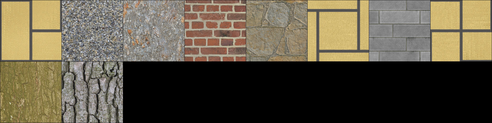

## Training results
The model was trained on different textures belonging both to different and same classes. The classes chosen are tatami, bricks and bark.
One experiment of the project was the implementation of EMA model.

### Real textures
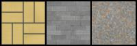
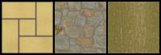
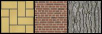

### Conditioning textures
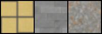
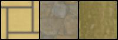
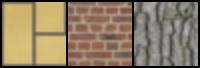

### Model 
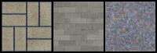
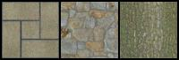
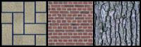

### EMA model 
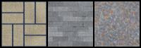
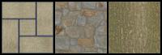
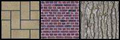
